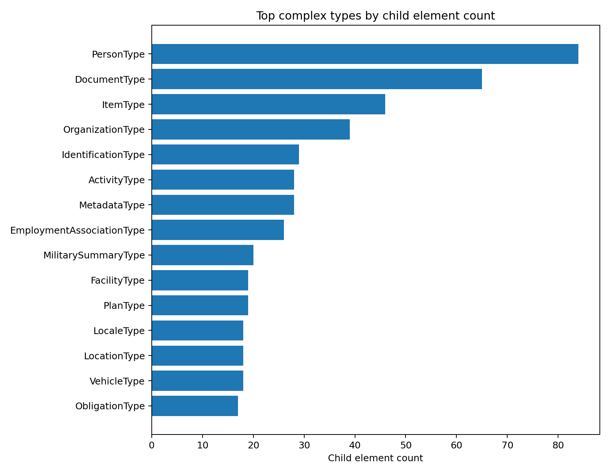
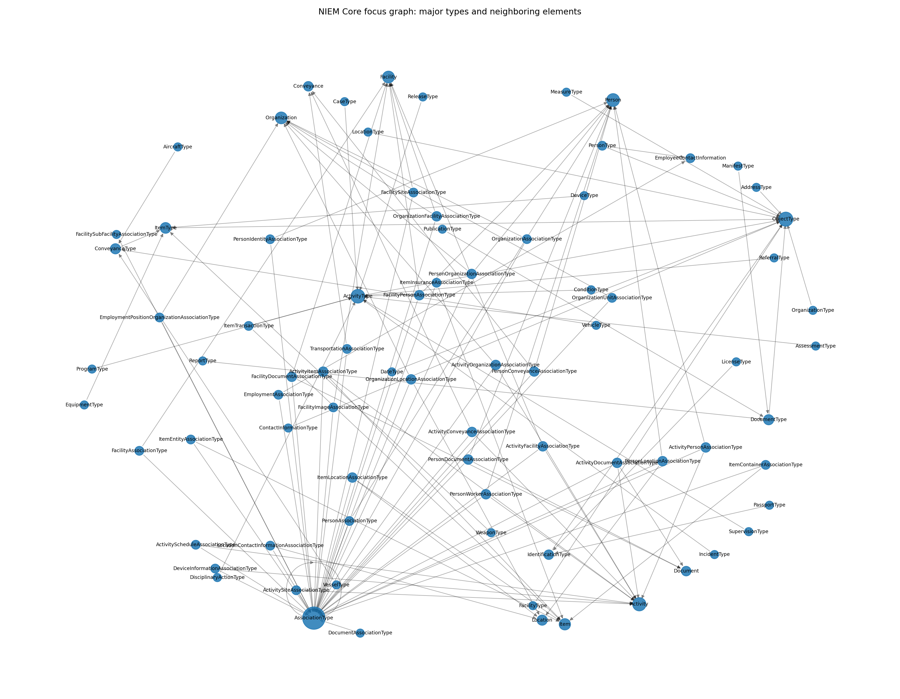

# NIEM Core XSD Analysis and Visualization

This repository provides an analysis and visualization of the **NIEM Core XSD schema**.

The goal of this project is to parse the structure of `niem-core.xsd`, extract important schema components, and convert them into tabular, graph-based, and visual representations.

NIEM Core is a large XML Schema Definition (XSD) that defines reusable data components for information exchange. Because the schema contains many elements, types, inheritance relationships, and substitution groups, graph-based analysis can help users better understand its structure.

## Project Overview

This project analyzes the NIEM Core schema from the following perspectives:

- Global XML elements
- Local/reference element occurrences
- Complex types and simple types
- Abstract elements
- Nillable elements
- Substitution group relationships
- Type inheritance relationships
- Element-to-type relationships
- Complex type containment relationships
- Graph representation of the schema structure
- Static and interactive visualizations

The analysis results are provided as CSV, JSON, GraphML, PNG, SVG, and HTML files.

## Repository Structure

```text
niem-core-analysis/
├── README.md
├── requirements.txt
├── data/
│   ├── complex_types.csv
│   ├── simple_types.csv
│   ├── elements.csv
│   ├── edges.csv
│   ├── summary.json
│   └── niem_core_graph.graphml
├── docs/
│   └── analysis.md
├── src/
│   └── analyze_niem.py
└── visualizations/
    ├── component_counts.png
    ├── component_counts.svg
    ├── relation_counts.png
    ├── relation_counts.svg
    ├── top_complex_types.png
    ├── top_complex_types.svg
    ├── focus_graph.png
    ├── focus_graph.svg
    └── focus_graph_interactive.html
```

## Analysis Summary

The following table summarizes the main components extracted from `niem-core.xsd`.

| Component | Count |
|---|---:|
| Complex types | 250 |
| Simple types | 41 |
| Global elements | 1,860 |
| Local/reference element occurrences | 1,416 |
| All `xs:element` declarations | 3,276 |
| Abstract global elements | 444 |
| Nillable global elements | 1,416 |
| Substitution group global elements | 310 |
| Parsed graph edges | 3,433 |

The element-related counts should be interpreted carefully:

```text
All xs:element declarations = Global elements + Local/reference element occurrences
3,276 = 1,860 + 1,416
```

The following categories are subsets of the 1,860 global elements:

- Abstract global elements
- Nillable global elements
- Substitution group global elements

Therefore, these subset counts should not be added to the global element count.

## Example Figures

### Top Complex Types by Child Element Count

This figure shows the largest complex types based on the number of child elements they contain.



### Focus Graph of Schema Relationships

This figure shows a focused graph view of selected schema relationships extracted from the NIEM Core XSD.



Open `visualizations/focus_graph_interactive.html` locally for an interactive network view.

## Schema Structure Overview

This section explains the major schema components analyzed in this project.

### Complex Types

**Complex types** are `xs:complexType` definitions in the XSD schema.

They describe structured data objects that can contain multiple child elements, attributes, or inherited structures. In NIEM Core, complex types often represent real-world entities, events, or information objects.

Examples include concepts such as:

- `PersonType`
- `ActivityType`
- `DocumentType`
- `OrganizationType`
- `ItemType`

A complex type can contain references to other elements and can also extend another complex type through inheritance.

For example:

```xml
<xs:complexType name="ActivityType">
  <xs:complexContent>
    <xs:extension base="structures:ObjectType">
      <xs:sequence>
        <xs:element ref="nc:ActivityIdentification" minOccurs="0" maxOccurs="unbounded"/>
        <xs:element ref="nc:ActivityDate" minOccurs="0" maxOccurs="unbounded"/>
        <xs:element ref="nc:ActivityName" minOccurs="0" maxOccurs="unbounded"/>
      </xs:sequence>
    </xs:extension>
  </xs:complexContent>
</xs:complexType>
```

This means that `ActivityType` is a structured object that extends another type and contains several activity-related child elements.

In this analysis, **250 complex types** were extracted from `niem-core.xsd`.

Complex types are important because they define the main structural patterns of NIEM Core. They show how individual elements are grouped into larger reusable information objects.

### Simple Types

**Simple types** are `xs:simpleType` definitions in the XSD schema.

They define restricted values, primitive data formats, controlled vocabularies, lists, or constrained value ranges. Unlike complex types, simple types do not contain child elements.

Simple types are commonly used to define:

- Code values
- Text restrictions
- Numeric ranges
- Date or time constraints
- Boolean, decimal, or token lists
- Enumeration values

For example:

```xml
<xs:simpleType name="DayOfWeekCodeSimpleType">
  <xs:restriction base="xs:token">
    <xs:enumeration value="MON"/>
    <xs:enumeration value="TUE"/>
    <xs:enumeration value="WED"/>
    <xs:enumeration value="THU"/>
    <xs:enumeration value="FRI"/>
    <xs:enumeration value="SAT"/>
    <xs:enumeration value="SUN"/>
  </xs:restriction>
</xs:simpleType>
```

This simple type restricts the allowed values to specific day-of-week codes.

In this analysis, **41 simple types** were extracted from `niem-core.xsd`.

Simple types are important because they define the allowed value space for specific schema components. They help ensure consistency and validation of XML instance data.

### Global Elements

**Global elements** are `xs:element` declarations defined at the top level of the XSD schema, directly under the root `xs:schema`.

They represent reusable NIEM Core data elements that can be referenced from multiple complex types or used as root-level XML elements.

Examples include concepts such as:

- `Person`
- `Activity`
- `Organization`
- `Location`
- `Document`
- `Item`

For example:

```xml
<xs:element name="Person" type="nc:PersonType"/>
<xs:element name="Activity" type="nc:ActivityType"/>
<xs:element name="Document" type="nc:DocumentType"/>
```

In this analysis, **1,860 global elements** were extracted from `niem-core.xsd`.

Global elements are important because they represent the main reusable vocabulary of the schema. They can be linked to complex types, used inside other structures, or referenced by external schemas.

### Local and Reference Element Occurrences

**Local/reference element occurrences** are `xs:element` declarations that appear inside complex type definitions rather than directly under `xs:schema`.

In NIEM Core, these internal element declarations commonly use the `ref` attribute to refer to globally defined elements.

For example:

```xml
<xs:complexType name="ActivityType">
  <xs:complexContent>
    <xs:extension base="structures:ObjectType">
      <xs:sequence>
        <xs:element ref="nc:ActivityIdentification" minOccurs="0" maxOccurs="unbounded"/>
        <xs:element ref="nc:ActivityDate" minOccurs="0" maxOccurs="unbounded"/>
        <xs:element ref="nc:ActivityName" minOccurs="0" maxOccurs="unbounded"/>
      </xs:sequence>
    </xs:extension>
  </xs:complexContent>
</xs:complexType>
```

In this example, `ActivityIdentification`, `ActivityDate`, and `ActivityName` are element references used inside `ActivityType`.

These occurrences are different from global element declarations:

- A **global element** defines a reusable schema term.
- A **local/reference element occurrence** shows where a global element is used inside a complex type.

In this analysis, **1,416 local/reference element occurrences** were identified.

Together, the global and local/reference element counts make up all `xs:element` declarations found in the schema:

```text
1,860 global elements + 1,416 local/reference element occurrences = 3,276 total xs:element declarations
```

Local/reference element occurrences are important because they show the internal composition of complex types. They help explain how NIEM Core data objects are assembled from reusable elements.

### Abstract Elements

**Abstract elements** are elements declared with `abstract="true"`.

They are not intended to be used directly in XML instance documents. Instead, they act as abstract placeholders or extension points that can be substituted by more specific concrete elements.

For example:

```xml
<xs:element name="ActivityCategoryAbstract" abstract="true"/>
```

An abstract element such as `ActivityCategoryAbstract` can be replaced by concrete elements that belong to its substitution group.

In NIEM, abstract elements are important because they support flexible and extensible information modeling across different domains.

In this analysis, **444 abstract global elements** were identified.

Abstract elements are a subset of global elements. They are included within the **1,860 global elements** count.

### Nillable Elements

**Nillable elements** are elements declared with `nillable="true"` in the XSD schema.

A nillable element is allowed to appear in an XML instance document without an actual value by using `xsi:nil="true"`.

For example:

```xml
<xs:element name="PersonBirthDate" type="nc:DateType" nillable="true"/>
```

An XML instance can then represent the element as:

```xml
<nc:PersonBirthDate xsi:nil="true"/>
```

This means that the element is present, but its value is intentionally empty, unknown, unavailable, or not applicable.

Nillable elements are different from omitted elements. If an element is omitted, the information is not provided. If an element appears with `xsi:nil="true"`, the information is explicitly represented as having no value.

In this analysis, **1,416 nillable global elements** were identified from `niem-core.xsd`.

Nillable elements are a subset of global elements. They are included within the **1,860 global elements** count.

In NIEM Core, nillable elements are important because they support flexible information exchange across different systems. They allow systems to preserve the structure of a message even when some values are unknown or unavailable.

### Substitution Group Elements

**Substitution group elements** are elements that can substitute for another element, often an abstract element.

They are declared using the `substitutionGroup` attribute.

Example:

```xml
<xs:element name="SomeConcreteElement"
            substitutionGroup="nc:SomeAbstractElement"/>
```

This means that `SomeConcreteElement` can be used wherever `SomeAbstractElement` is expected.

In NIEM Core, substitution groups are widely used to support extensibility. They allow domain-specific or more concrete elements to be used in place of general abstract elements.

In this analysis, **310 substitution group global elements** were extracted.

Substitution group elements are a subset of global elements. They are included within the **1,860 global elements** count.

### Parsed Graph Edges

The XSD schema was transformed into a graph representation.

In this graph:

- Nodes represent schema components such as elements, complex types, simple types, namespaces, and imported schemas.
- Edges represent structural relationships between those components.

The extracted graph includes the following relationship types:

| Edge Type | Meaning |
|---|---|
| `extends` | A complex type extends another type |
| `contains` | A complex type contains a child element |
| `has_type` | An element is assigned a specific type |
| `substitution_group` | An element substitutes for another element |
| `imports` | The schema imports another namespace or schema document |

Example graph relationships include:

```text
PersonType -> contains -> PersonName
Person -> has_type -> PersonType
AssessmentType -> extends -> ActivityType
ActivityCategoryCode -> substitution_group -> ActivityCategoryAbstract
niem-core.xsd -> imports -> structures.xsd
```

In this analysis, **3,433 graph edges** were parsed from the schema.

## Largest Complex Types

The following complex types contain the largest number of child elements.

| Rank | Complex Type | Number of Child Elements |
|---:|---|---:|
| 1 | `PersonType` | 84 |
| 2 | `DocumentType` | 65 |
| 3 | `ItemType` | 46 |
| 4 | `OrganizationType` | 39 |
| 5 | `IdentificationType` | 29 |

These large complex types represent central NIEM Core concepts. For example, `PersonType` includes many properties related to names, identifiers, demographics, contact information, physical characteristics, and other person-related data.

## Output Files

### Data Files

The `data/` directory contains structured outputs generated from the XSD parser.

| File | Description |
|---|---|
| `summary.json` | Overall schema statistics |
| `complex_types.csv` | Complex type definitions, base types, and child counts |
| `simple_types.csv` | Simple type definitions and enumerations |
| `elements.csv` | Global element definitions and properties |
| `edges.csv` | Edge list representing schema relationships |
| `niem_core_graph.graphml` | GraphML file for network analysis tools |

The GraphML file can be opened using tools such as:

- Gephi
- Cytoscape
- yEd
- NetworkX

### Visualization Files

The `visualizations/` directory contains static and interactive visualizations.

| File | Description |
|---|---|
| `component_counts.png` / `.svg` | Counts of major schema components |
| `relation_counts.png` / `.svg` | Counts of parsed graph edge types |
| `top_complex_types.png` / `.svg` | Largest complex types by child element count |
| `focus_graph.png` / `.svg` | Focused graph visualization of selected schema relationships |
| `focus_graph_interactive.html` | Interactive schema graph visualization |

The interactive HTML file can be opened directly in a web browser.

## Usage

This repository provides pre-generated analysis results and visualizations for the NIEM Core XSD schema.

Users can:

- Review the extracted schema components in the `data/` directory.
- Read the detailed analysis report in `docs/analysis.md`.
- Open the static visualization files in the `visualizations/` directory.
- Open `visualizations/focus_graph_interactive.html` in a web browser for interactive exploration.
- Load `data/niem_core_graph.graphml` into graph analysis tools such as Gephi, Cytoscape, or yEd.
- Re-run the analysis script using `src/analyze_niem.py`.

## Methodology

The analysis script parses `niem-core.xsd` and extracts schema-level structures using XML parsing.

The main steps are:

1. Parse the XSD file.
2. Extract imported namespaces and schema locations.
3. Extract all global complex types.
4. Extract all global simple types.
5. Extract all global elements.
6. Extract local/reference element occurrences inside complex types.
7. Identify abstract elements.
8. Identify nillable elements.
9. Identify substitution group elements.
10. Extract inheritance relationships between complex types.
11. Extract child elements contained in complex types.
12. Extract element-to-type relationships.
13. Build a graph representation of the schema.
14. Export tabular data, graph data, and visualizations.

## Reproducing the Analysis

Install the required Python packages:

```bash
pip install -r requirements.txt
```

Run the analysis script:

```bash
python src/analyze_niem.py
```

The script generates updated outputs in the `data/`, `docs/`, and `visualizations/` directories.

## Notes on the Original XSD File

This repository is intended to share analysis results and visualization outputs derived from the NIEM Core XSD schema.

The original `niem-core.xsd` file is not required for viewing the generated CSV, JSON, GraphML, PNG, SVG, and HTML outputs.

If the original XSD file is included in this public repository, users should verify that redistribution is consistent with the applicable NIEM/OASIS license terms. If there are licensing or redistribution concerns, the original XSD file should be excluded while keeping the generated analysis files.

## Possible Use Cases

This analysis can be useful for:

- Understanding the structure of NIEM Core
- Exploring XML schema design patterns
- Studying schema extensibility through abstract elements and substitution groups
- Converting XSD structures into graph representations
- Preparing schema analysis for research or documentation
- Building knowledge graph or ontology-based schema exploration tools
- Supporting semantic interoperability studies

## Limitations

This project focuses on structural analysis of the XSD schema.

It does not fully evaluate the semantic meaning of every NIEM Core component, and it does not validate XML instance documents against the schema. Some imported schemas or external dependencies may require additional processing for full NIEM-wide analysis.

The graph representation is intended as an analytical abstraction of the XSD structure, not as a complete replacement for the original schema.

## License and Attribution

This repository is based on structural analysis of the NIEM Core XSD schema.

The original NIEM Core schema is maintained by NIEM/OASIS. This repository does not claim ownership of the original schema.

The analysis scripts, generated data files, and visualizations are provided for research and documentation purposes.

Before reusing or redistributing the original NIEM Core XSD file or derivative materials, please verify the applicable NIEM/OASIS license terms.
